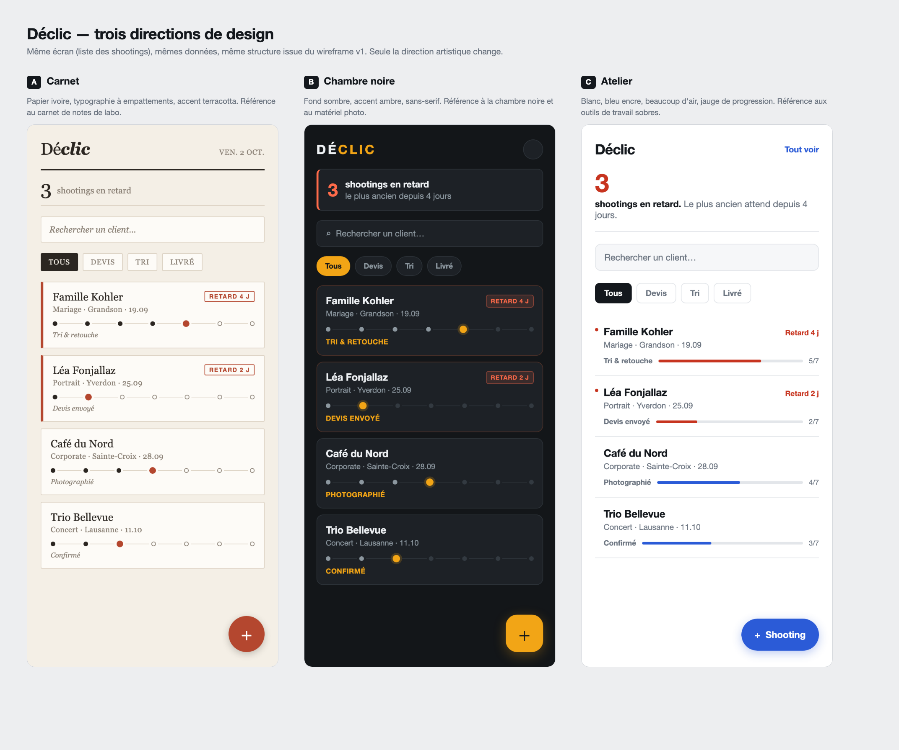

# Critique comparative des trois propositions

**Application :** Déclic · **Écran comparé :** liste des shootings
**Méthode :** les trois propositions montrent **le même écran, les mêmes données et la même
structure** (celle du [wireframe v1](wireframes/wireframe-v1.png)). Seule la direction artistique
change — sinon je comparerais des maquettes différentes, pas des directions.

| | Direction | Fichier |
|---|---|---|
| **A** | Carnet — papier ivoire, empattements, terracotta | [proposition-1-carnet.png](propositions/proposition-1-carnet.png) |
| **B** | Chambre noire — fond sombre, ambre, sans-serif | [proposition-2-chambre-noire.png](propositions/proposition-2-chambre-noire.png) |
| **C** | Atelier — blanc, bleu encre, jauge de progression | [proposition-3-atelier.png](propositions/proposition-3-atelier.png) |

---

## Les critères, et pourquoi ce sont ceux-là

Je ne note pas « laquelle est la plus belle ». Je note contre le persona et contre le brief, parce
que c'est la seule façon de pouvoir défendre le choix ensuite.

| Critère | D'où il vient |
|---|---|
| Lisibilité en extérieur | Nora lit son téléphone en plein soleil ([persona.md](persona.md)) |
| Contraste mesuré | Exigence que je me suis fixée : 4.5:1 minimum ([brief.md](../brief.md)) |
| Lecture du retard en 1 seconde | C'est la question n°1 du persona |
| Information jamais portée par la couleur seule | Accessibilité, et aussi lecture au soleil |
| Lecture de l'avancement | Les 7 étapes doivent se lire sans compter |
| Densité | 4 fiches visibles sans scroller |
| Personnalité | L'app doit ressembler à un outil de photographe, pas à un logiciel de gestion |

---

## Contrastes mesurés

Calculés sur les couleurs réelles des maquettes, pas à l'œil.

| Élément | A · Carnet | B · Chambre noire | C · Atelier |
|---|---|---|---|
| Texte principal | 14.49:1 ✅ | 14.27:1 ✅ | **17.82:1 ✅** |
| Texte secondaire (type, lieu, date) | **3.75:1 ❌** | 5.43:1 ✅ | 4.74:1 ✅ |
| Libellé de l'étape courante | **3.75:1 ❌** | 7.84:1 ✅ | 4.74:1 ✅ |
| Signal « en retard » | 5.23:1 ✅ | 5.74:1 ✅ | 5.33:1 ✅ |

**A échoue deux fois**, et sur les deux informations que Nora lit le plus souvent : le type de
shooting et l'étape en cours. Ce n'est pas un détail de finition, c'est la lecture courante.

---

## A · Carnet

**Ce qui marche.** C'est la plus personnelle des trois. Le papier ivoire et les empattements
donnent un objet qui ne ressemble à aucun autre outil de gestion — exactement l'intention du brief.
Le filet noir sous le titre et la date en capitales installent un vrai ton éditorial.

**Ce qui ne marche pas.**

1. **Deux informations partagent la même couleur.** Le terracotta sert à la fois pour la pastille
   « RETARD 4 J » **et** pour la pastille de l'étape courante. Un œil rapide ne sait pas si le
   point coloré au milieu de la frise signale une étape ou un problème.
2. **Le texte secondaire tombe à 3.75:1.** En intérieur ça passe ; au soleil, non.
3. **L'italique pour l'étape courante** est le traitement le plus faible de la carte alors que
   c'est l'information la plus utile.
4. **La frise est décorative plus qu'informative** : elle montre la position, mais il faut compter
   les points pour savoir combien d'étapes restent.

**Verdict.** La meilleure identité, la moins bonne lisibilité. Non retenue telle quelle.

---

## B · Chambre noire

**Ce qui marche.** Tous les contrastes passent, et largement. L'ambre sur fond sombre est le
rappel le plus direct du métier (les lampes inactiniques, les écrans de retouche). Le bloc
d'alerte en haut est le meilleur des trois : il donne le nombre **et** le niveau d'urgence
(« le plus ancien depuis 4 jours »). Les étapes en capitales colorées se repèrent instantanément.

**Ce qui ne marche pas.**

1. **C'est le pire choix pour le contexte d'usage réel.** Nora utilise l'app dehors, en plein
   soleil, debout. Une interface sombre renvoie l'environnement : l'écran devient un miroir. Les
   chiffres de contraste sont excellents en laboratoire et trompeurs sur le terrain.
2. **Deux couleurs d'accent concurrentes.** L'ambre marque l'étape courante, le filtre actif et le
   bouton « + » ; le rouge marque le retard. Deux systèmes de signalisation qui se disputent l'œil.
3. **Les cartes sont lourdes.** Bordures, fonds, ombres : à quatre fiches l'écran est déjà plein,
   et le brief en demande une liste de trente.

**Verdict.** La plus séduisante en capture d'écran, la moins adaptée au terrain. C'est exactement
le piège que le roast m'a appris à repérer : une maquette se juge dans son contexte, pas sur un
écran de bureau.

---

## C · Atelier

**Ce qui marche.**

1. **Le meilleur contraste des trois** (17.82:1 sur le texte principal) et aucun échec.
2. **La jauge donne une information que les deux autres n'ont pas.** « 5/7 » se lit sans compter
   les points. On sait d'un coup où en est le shooting *et* combien il reste.
3. **Le « 3 » en gros rouge** est le premier élément lu de l'écran. C'est la question du persona,
   placée au bon endroit.
4. **Pas de cartes, des lignes séparées par un filet.** La liste respire et supporte trente fiches
   sans devenir un mur.
5. **Le retard est signalé trois fois** : point rouge, texte « Retard 4 j », jauge rouge. Jamais
   par la couleur seule.

**Ce qui ne marche pas.**

1. **C'est la moins personnelle.** Sans le mot « Déclic » en haut, cet écran pourrait être une app
   bancaire ou une messagerie. Le brief demandait « un outil d'atelier » : je suis plutôt tombé sur
   « un outil », tout court.
2. **Le point rouge de retard fait 5 px.** C'est trop petit pour être le signal principal — il est
   heureusement doublé par le texte.
3. **Le bleu est un choix par défaut.** Il est lisible, mais il ne raconte rien sur la photographie.

**Verdict.** Retenue.

---

## Décision

> **Je retiens la proposition C · Atelier comme base**, corrigée avec deux éléments repris
> à A et à B.

**Pourquoi C plutôt que B**, alors que B est plus belle : le facteur décisif est le contexte
d'usage. Nora travaille dehors. Une interface sombre au soleil, c'est un miroir. Entre « plus
belle en capture » et « lisible au moment où on s'en sert », le brief tranche pour le second.

**Pourquoi C plutôt que A** : A échoue sur le contraste à deux endroits, et la même couleur y
signifie deux choses différentes. Ce sont deux défauts que j'ai relevés chez quelqu'un d'autre
pendant le roast — je ne vais pas les reproduire volontairement.

### Ce que je corrige sur C avant de la coder

| # | Correction | D'où ça vient |
|---|---|---|
| 1 | Remplacer le bleu générique par une couleur d'accent plus personnelle, et garder le rouge **uniquement** pour le retard | Faiblesse de C |
| 2 | Reprendre le bloc d'alerte de B, avec sa deuxième ligne « le plus ancien depuis 4 jours » | Force de B |
| 3 | Reprendre la date du jour en capitales dans l'en-tête | Force de A |
| 4 | Donner du caractère au grand chiffre (graisse et chasse plus marquées) sans toucher au texte courant | Faiblesse de C |
| 5 | Faire passer le point de retard de 5 px à 8 px | Faiblesse de C |

**Ce que je ne reprends pas, et pourquoi :** le fond sombre de B (contexte d'usage), les
empattements de A (ils coûtent en lisibilité à petite taille pour un gain uniquement décoratif).

---

## Ce que l'exercice m'a appris

Je suis parti en pensant choisir A, parce que c'est celle que je trouve la plus belle et la plus
proche de mon goût. Ce sont les deux mesures de contraste qui ont tranché contre elle — et c'est
exactement le point de l'exercice : **sans critères écrits à l'avance, j'aurais choisi au goût, et
j'aurais choisi une interface que mon utilisatrice ne peut pas lire au soleil.**
